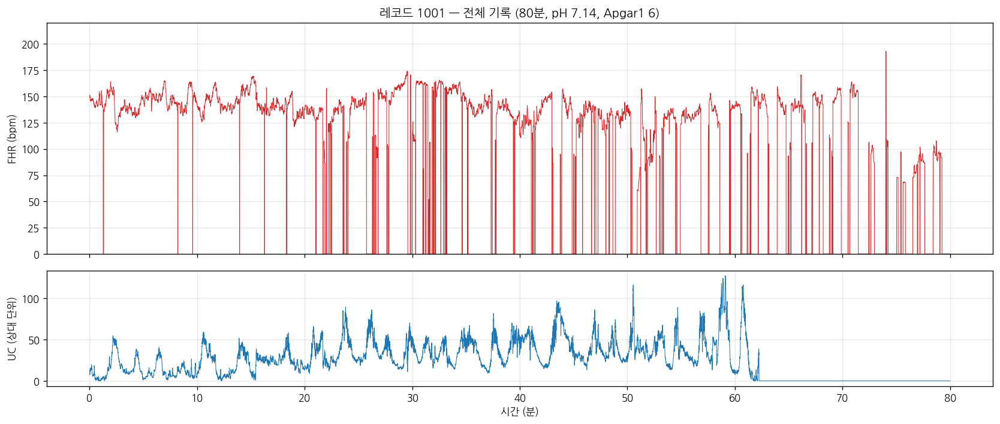
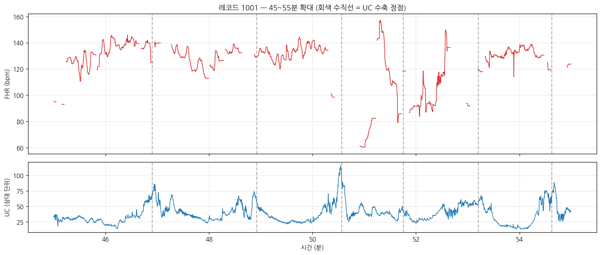
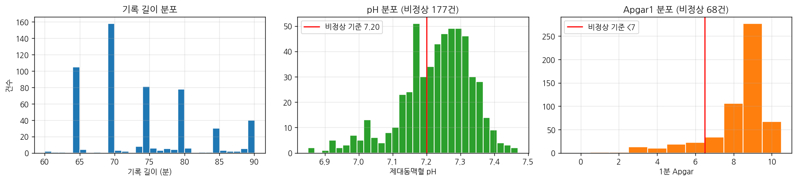
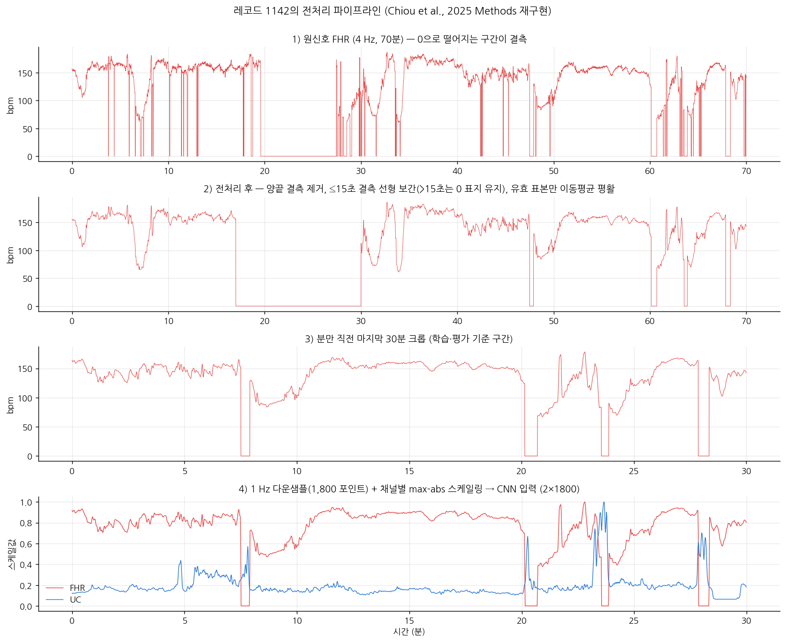
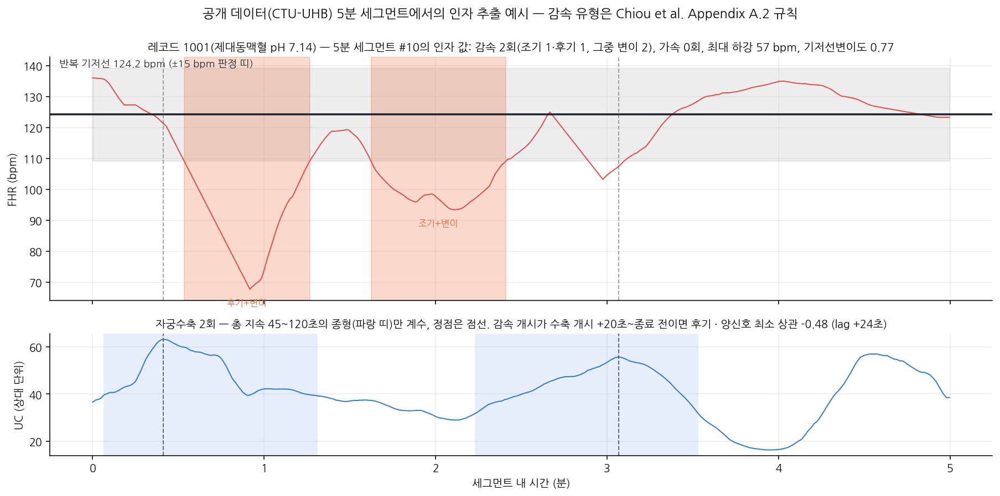
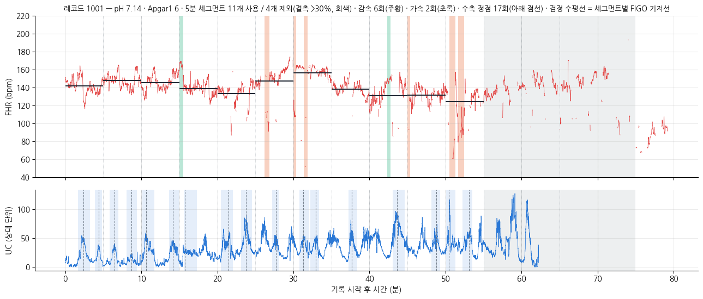

# FetalGuard-AI — CTU-UHB 사전 검증

FetalGuard-AI는 분만 중 CTG(cardiotocography)의 전문의 판독을, 임상 용어로 정의된
파형 인자 단위로 분해·예측하는 연구 제안이다. 이 저장소는 그 계획서의 Data availability가
약속한 공개 코드 3종과, 그 입력(공개 데이터셋 CTU-UHB 전체)·산출물(552건 전수 변환
결과와 시각화)을 한 곳에 담은 자기완결(self-contained) 저장소다. 외부 경로 참조 없이 이
저장소만으로 계획서의 모든 그림·수치가 재현된다.

## 연구의 구도 — 이 저장소가 실증하는 것

CTG 판독 자동화의 최근 선행 연구는 라벨의 성격으로 갈린다. 국내 다기관 연구(박창은,
2025)는 전문의의 판독을 대형 CNN으로 맞혔지만 판단 근거를 임상 용어로 설명하지 못하고,
Google Research의 연구(Chiou et al., *npj Women's Health* 2025;3:21)는 CTU-UHB에서 객관적
출생 아웃컴(제대동맥혈 pH·Apgar)을 예측하며 두 가지 방법론 축을 세웠다 — FIGO 규칙 기반
인자로 예측하는 축과, 그 인자 기반 접근을 심층학습과 같은 조건에서 겨루는 축이다. 두 축
모두 객관 라벨에서만 수행되었다. CTU-UHB에는 판독 라벨이 없기 때문이다.

본 제안은 이 두 축을, 전문의 판독 라벨이 있는 국내 데이터([건양대학교의료원] 태아 심박동
모니터링 데이터, 안심존 폐쇄 분석환경)로 옮기는 것이다. 안심존은 입장 후 시행착오의
비용이 큰 환경이므로, 방법론 전체를 공개 데이터에서 먼저 구현·검증했다. 그 결과가 이
저장소의 세 부분이다.

| 경로 | 내용 | 계획서 대응 |
|---|---|---|
| `ctu-hub-ctgdb/` | CTU-UHB Intrapartum CTG DB v1.0.0 전체 (552 레코드, `.hea`+`.dat`, 41 MB) | 3.2절 |
| [`1-dataset-walkthrough/`](1-dataset-walkthrough/) | 데이터셋을 전수 파싱·검증하고 레코드 하나로 처음부터 끝까지 해부하는 노트북 | 3.2절 |
| [`2-google-reproduction/`](2-google-reproduction/) | Chiou et al. (2025)의 전처리·특성·모델 재구현과 552건 전수 변환 | 3.3절 |
| [`3-poc-factor-extraction/`](3-poc-factor-extraction/) | 본 제안의 인자 카탈로그 Cat28 — 정의·배치 변환·설계 근거 실측 | 4.1·5.1·5.4절 |

세 디렉토리는 모두 같은 형태를 갖는다 — **정의(코드) · 552건 전수 변환 결과(`log/`) ·
레코드별 시각화(`figures/`) · 샘플 1건을 눈으로 따라가는 워크스루 노트북(실행 완료)**.
모든 수치는 배치 결과와 워크스루가 서로를 검증하도록 짜여 있다.

---

## 1. 데이터셋의 이해 — `1-dataset-walkthrough/`

CTU-UHB(Chudáček et al., 2014)는 체코 브르노 대학병원에서 2010년 4월부터 2012년
8월까지 수집된 9,164건의 분만 중 CTG에서 선별된 552건이다. 각 레코드는 분만 직전 최대
90분의 FHR(태아 심박동)·UC(자궁수축) 2채널 4 Hz 신호이며, 출생 직후의 객관적
아웃컴(제대동맥혈 pH·BDecf·BE·Apgar)과 산모 메타데이터가 붙어 있다. 제대동맥혈 pH가
전수 확보된 사실상 유일한 공개 분만 중 CTG 자원으로, 이 분야의 표준 벤치마크다.

552건 전체를 직접 파싱하고 헤더 체크섬 대조로 바이너리 읽기 정확성을 확인했다. 총 기록
시간은 약 40,938분(레코드당 평균 74.2분), FHR 결측률은 레코드 평균 18.8%다. 결측(신호값
0)은 심박수가 아니라 센서 접촉 불량 등에 의한 신호 소실이며 분만이 진행될수록 늘어난다 —
모든 분석이 결측 처리에서 출발해야 하는 이유다.



판독의 핵심 축은 두 신호의 시간 관계다. 자궁수축 정점을 기준으로 태아 심박동이 언제
하강하는지가 감속의 임상적 의미를 가른다.



라벨의 성격도 전수 재계산했다. Chiou et al.의 기준으로 pH < 7.20이 177건(32.1%),
1분 Apgar < 7이 68건(12.3%), 합집합이 198건(35.9%)이며 논문 보고치와 정확히 일치한다.
주목할 것은 두 지표의 어긋남이다 — **교집합은 47건뿐이고**, Apgar 저하 68건 중 21건(31%)은
pH가 정상, pH 저하 177건 중 130건(73%)은 Apgar가 정상이다. '실제 태아 상태'를 정의한다는
두 지표조차 서로의 4분의 1에서 3분의 1만 공유한다는 사실은, 판독-아웃컴 괴리를 다루는
본 제안의 부가 가설(H5)의 출발점이다.



`ctu_uhb_walkthrough.ipynb`가 파일 포맷 해부부터 위 요약 통계까지 레코드 1001 하나로
전 과정을 보이고, `figures/01~07`이 계획서 3.2절의 그림 원본이다.

## 2. Chiou et al. (2025) 재구현 — `2-google-reproduction/`

Chiou et al.은 Google Research·Google DeepMind·Stanford 연구진의 연구로, CTU-UHB에서
태아 상태 악화를 예측하는 소형 CNN을 학습하고 정답 라벨·신호 구간·입력 구성의 영향을
체계적으로 평가했다. 모델은 CTG-net(Ogasawara et al., 2021; 기반 구조 기준 약 2,100
파라미터) 기반으로, 필터 수·완전연결 은닉층 구성은 500개 무작위 구성으로 탐색했으며
선택된 구성은 공개되어 있지 않다. 본 제안의 방법론이 이 연구의 두 축
위에 서 있으므로, 전처리·특성·모델을 코드 수준에서 재구현했다. 수치 명세(전처리 단계,
특성 규칙의 임계값)는 출판본이 아니라 medRxiv 프리프린트(doi:10.1101/2024.03.05.24303805)
Appendix A에 있으며, 재구현은 그 명세를 따른다.

| 파일 | 내용 |
|---|---|
| `ctguhb.py` | WFDB format 16 리더 (패키지 불필요) — 체크섬 검증, 메타데이터, 논문 Eq. (1)의 세 라벨 |
| `preprocess.py` | 신경망 파이프라인 전처리 7단계 (품질 평가 → 결측 15초 분류 → 15pt Hamming 평활 → 30분 크롭 → 1 Hz → max-abs; Appendix A.1 명세) |
| `features.py` | 규칙 기반 특성 17개 + XGBoost 설정 (Appendix A.2 명세의 수축·기저선·가속·감속 유형 규칙) |
| `model.py` | CTG-net (Ogasawara et al., 2021)의 PyTorch 재구현 + 논문의 1채널·메타데이터·완전연결 은닉층 변형 |
| `run_all.py` | 552건 전수 실행 — 두 파이프라인을 전 레코드에 적용 (단일 CPU 3.4초) |
| `log/ctu_features17.csv` | 552행 × (라벨 + 전처리 통계 + 특성 17개) |
| `log/ctu_model_inputs.npz` | 552건의 CTG-net 입력 텐서 (552 × 2 × 1,800) |
| `log/summary.md` | 논문 보고값과의 대조 — 라벨 분포 3종 정확 일치, 논문 496/56 분할의 산술 확인 |
| `figures/records/` | 레코드별 판정 근거 시각화 552장 |
| `reproduction_walkthrough.ipynb` | 샘플 1건(레코드 1001) 워크스루 (실행 완료) — 마지막 셀에서 배치 CSV·NPZ와 값 일치를 검증 |



숫자 하나를 분명히 해 둔다. 논문 전처리 절의 (n = 496)·(n = 56)은 분석에서 제외된
레코드가 있다는 뜻이 아니라 **90%/10% 학습·테스트 분할**이다 — Data splitting 절이
레코드 식별자의 10%를 테스트로 고정하고 나머지 90%를 10-fold 교차검증에 썼다고
명시하며, 산술도 맞물린다(496 + 56 = 552, 학습 148,800분 = 496건 × 증강 크롭 10개 ×
30분, 테스트 1,680분 = 56건 × 결정론적 크롭 1개). 실제로 이 데이터셋의 원신호는 전부
60분 이상이라 30분 크롭은 552건 모두 가능하고, 이 저장소의 전수 변환도 552건 전부를
처리한다(`log/summary.md`).

## 3. Cat28 인자 추출 — `3-poc-factor-extraction/`

본 제안의 핵심 자산이다. 각 5분 세그먼트에서 28개 파형 인자를 정의한다. 인자는 모두
신호로부터 결정론적으로 계산되는 수치로, 판정이나 해석을 포함하지 않으며 같은 신호에서는
항상 같은 값이 나온다. 설계 원칙은 둘이다 — 임상의의 판독 문법(기저선, 변이도, 감속과 그
유형, 자궁수축, 두 신호의 시간 관계)과 정렬될 것, 그리고 선행 연구가 유효성을 보인
집합(Chiou et al.의 FIGO 17개, 국내 연구의 통계량 7개)을 포괄할 것.

| 그룹 | 인자 |
|---|---|
| ① 신호 수준 (4) | `fhr_mean` `fhr_min` `fhr_max` `fhr_sd` |
| ② 기저선·분포 (4) | `figo_baseline` `hist_median` `hist_mode` `hist_width` |
| ③ 변이도 (2) | `stv` `figo_baseline_var` |
| ④ 범위 일탈 (2) | `brady_frac` `tachy_frac` |
| ⑤ 감속·가속 (9) | `n_decel` `decel_max_depth` `decel_time_frac` `n_accel` `n_early_decel` `n_late_decel` `n_variable_decel` `n_severe_decel` `n_prolonged_decel` |
| ⑥ 자궁수축·결합 (7) | `toco_mean` `toco_max` `toco_sd` `n_contractions` `ft_corr0` `ft_corr_min` `ft_corr_min_lag_s` |

정의의 준거를 분명히 했다. Chiou et al.의 17개와 겹치는 인자 중 판정 규칙이 있는
것(기저선·변이도·가속·감속과 그 유형·수축)은 그들의 Appendix A.2 계산 규칙을 그대로
따르며, 구현은 `../2-google-reproduction/features.py`를 직접 임포트해 재현 실험과 인자
추출이 같은 코드를 쓴다 — 판정 규칙의 정의가 갈라질 여지를 없앴다. FHR 히스토그램
통계(중앙값·최빈값·폭)는 같은 정의(24구간 히스토그램)를 5분 세그먼트 창에 적용해
계산한다. ⑥의 결합 상관 계열은 A.2에 없는 본 제안의 추가
인자로, Chiou et al.이 특성 기반의 약점으로 지목한 "시간적 맥락 단서의 소실"에 대한 설계적
응답이다. 코드가 곧 정의다.



위 그림의 세그먼트(제대동맥혈 pH 7.14 레코드)에서 첫 감속은 수축 개시 20초 넘게
뒤(+28초)에 시작해 수축 종료 전이므로 **후기**, 둘째는 그 조건을 벗어나고 3분 미만이라
**조기**로 분류되며, 둘 다 개시에서 최저점까지 30초 미만(23초·29초)이라 **변이**로도 함께
계수된다 — 조기·후기·장기·중증이
감속 집합의 분할이고 변이가 그와 겹치는 독립 축이라는 A.2 규칙의 구조가 그대로 드러난다.

552건 전체에 적용한 실측 결과: 6,400개 5분 세그먼트(결측 30% 초과 1,098개 제외)에서 28개
인자를 단일 CPU 31초에 계산했다. 검출된 감속 3,564회는 조기 2,734·후기 829·장기 1·중증
0회로 분할되었고(합이 감속 수와 정확히 일치), pH < 7.20 레코드에서 감속 최대 깊이·후기감속
수·서맥 비율·기저선 변이도가 일관되게 높은, 임상 예상과 일치하는 방향성을 확인했다.

설계 근거도 어림이 아니라 실측이다. `verify_design_choices.py`가 계획서 5.1절이 인용하는
세 가지 설계 선택의 민감도를 재현한다.

1. **기저선 — 반복 추정 vs 세그먼트 중앙값.** 감속이 깊은 세그먼트일수록 중앙값이 끌려
   내려가 판정이 달라진다 (감속 수 판정이 달라지는 세그먼트 7.8%, 기준선 차이 최대 36.0 bpm).
2. **수축 검출 — 상대 vs 절대 임계값.** 세그먼트별 수축 수의 상관이 0.54에 그친다.
   감속 유형 분류가 여기 의존하므로 민감도 분석 대상으로 둔다.
3. **결합 상관 — 창별 피어슨 vs 전역 표준화 후 곱 평균.** 전역 표준화는 겹친 창의
   실제 중심·산포가 전역 값과 어긋나 상관 크기를 0 쪽으로 누른다
   (창별 −0.80이 0.00으로 나오는 세그먼트 확인).

| 파일 | 내용 |
|---|---|
| `extract_factors_ctu.py` | Cat28 28개의 정의·계산 절차 전체 (계획서 5.1절 28행 표의 구현) |
| `verify_design_choices.py` | 위 세 가지 설계 근거 실측 |
| `log/ctu_segment_factors.csv` | 6,400 세그먼트 × Cat28 (+ 레코드 ID, 결측률, pH/Apgar 라벨) |
| `log/design_choices.md` | 설계 근거 실측 결과 (계획서 5.1절이 인용하는 수치의 출처) |
| `log/summary.md` | 전수 변환 요약 — 소요 시간, pH 라벨 기준 인자 방향성 점검 |
| `figures/records/` | 레코드별 판정 근거 시각화 552장 |
| `cat28_walkthrough.ipynb` | 샘플 1건(레코드 1001, 세그먼트 #10) 워크스루 (실행 완료) — 마지막 셀에서 배치 CSV와 값 일치를 검증 |

레코드별 시각화는 세그먼트별 기저선·감속(주황)·가속(초록)·수축 정점·제외 세그먼트(회색)를
기록 전체 위에 겹쳐, 6,400세그먼트 어느 값이든 눈으로 추적할 수 있게 한다.



---

## 재현

의존성: `pip install -r requirements.txt` (표준 과학 스택 + 노트북 도구. WFDB 리더 패키지
불필요 — 바이너리를 numpy로 직접 읽고 헤더 체크섬으로 검증한다.)

```bash
# 1) 데이터셋 walkthrough 노트북 (재생성·재실행 시)
cd 1-dataset-walkthrough
python build_notebook.py
jupyter nbconvert --to notebook --execute --inplace ctu_uhb_walkthrough.ipynb

# 2) Chiou et al. (2025) 재구현 — 552건 전체 변환과 시각화
cd ../2-google-reproduction
python run_all.py                    # log/ctu_features17.csv, ctu_model_inputs.npz, summary.md (약 3초)
python make_figures.py               # figures/11_preprocessing.png
python make_record_figures.py        # figures/records/*.png 552장 (약 2분)
python build_reproduction_notebook.py
jupyter nbconvert --to notebook --execute --inplace reproduction_walkthrough.ipynb

# 3) Cat28 — 552건 전체 변환과 시각화
cd ../3-poc-factor-extraction
python extract_factors_ctu.py        # log/ctu_segment_factors.csv (약 31초)
python verify_design_choices.py      # log/design_choices.md (5.1절 설계 근거 실측)
python make_figure.py                # figures/poc_factor_anatomy.png
python make_record_figures.py        # figures/records/*.png 552장 (약 2분)
python build_cat28_notebook.py
jupyter nbconvert --to notebook --execute --inplace cat28_walkthrough.ipynb
```

`reproduction_walkthrough.ipynb`의 CTG-net 셀만 `torch`를 필요로 하며, 없으면 그 셀은
건너뛰고 나머지는 그대로 실행된다. 인자 추출이 단일 CPU 31초, 전체 파이프라인이 보급형
노트북에서 수 분 안에 끝나는 것은 우연이 아니라 요구사항이다 — 본 검증이 수행될 안심존은
대규모 GPU를 전제할 수 없는 폐쇄 환경이므로, 자원 요구량 실측 자체가 계획서 5.4절의
내용이다.

## 계획서 그림 ↔ 이 저장소의 파일

| 계획서 그림 | 원본 |
|---|---|
| 그림 3-2-1 (전체 기록) | `1-dataset-walkthrough/figures/01_full_trace.png` |
| 그림 3-2-2 (10분 확대) | `1-dataset-walkthrough/figures/03_zoom.png` |
| 그림 3-2-3 (데이터셋 분포) | `1-dataset-walkthrough/figures/06_dataset_dist.png` |
| 그림 3-2-4 (정상 vs 비정상) | `1-dataset-walkthrough/figures/07_normal_vs_abnormal.png` |
| 그림 3-3-1 (전처리 단계) | `2-google-reproduction/figures/11_preprocessing.png` |
| 그림 5-1-1 (인자 해부도) | `3-poc-factor-extraction/figures/poc_factor_anatomy.png` |

## 데이터셋 출처와 라이선스

`ctu-hub-ctgdb/`는 PhysioNet의 공개 데이터셋
[CTU-UHB Intrapartum Cardiotocography Database v1.0.0](https://physionet.org/content/ctu-uhb-ctgdb/1.0.0/)
원본 그대로다(552 레코드, FHR·UC 2채널 4 Hz, 제대동맥혈 pH·Apgar 등 아웃컴 포함.
무결성은 동봉된 `SHA256SUMS.txt`로 확인 가능). Open Data Commons Attribution License
v1.0으로 배포되며, 사용 시 다음을 인용한다.

- Chudáček V, Spilka J, Burša M, Janků P, Hruban L, Huptych M, Lhotská L. Open access
  intrapartum CTG database. *BMC Pregnancy and Childbirth* 2014;14:16.
- Goldberger AL, et al. PhysioBank, PhysioToolkit, and PhysioNet. *Circulation*
  2000;101:e215–e220.

재구현 대상 논문:

- Chiou N, Young-Lin N, Kelly C, et al. Development and evaluation of deep learning models
  for cardiotocography interpretation. *npj Women's Health* 2025;3:21.
  (전처리·특성 규칙의 수치 명세는 medRxiv 프리프린트
  [doi:10.1101/2024.03.05.24303805](https://doi.org/10.1101/2024.03.05.24303805)의 Appendix A)
- Ogasawara J, Ikenoue S, Yamamoto H, et al. Deep neural network-based classification of
  cardiotocograms outperformed conventional algorithms. *Scientific Reports* 2021;11:13367.

[건양대학교의료원] 태아 심박동 모니터링 데이터는 안심존 폐쇄 분석환경에서만 접근 가능하며,
이 저장소에는 해당 데이터의 어떤 분석 결과도 포함되지 않았다.
